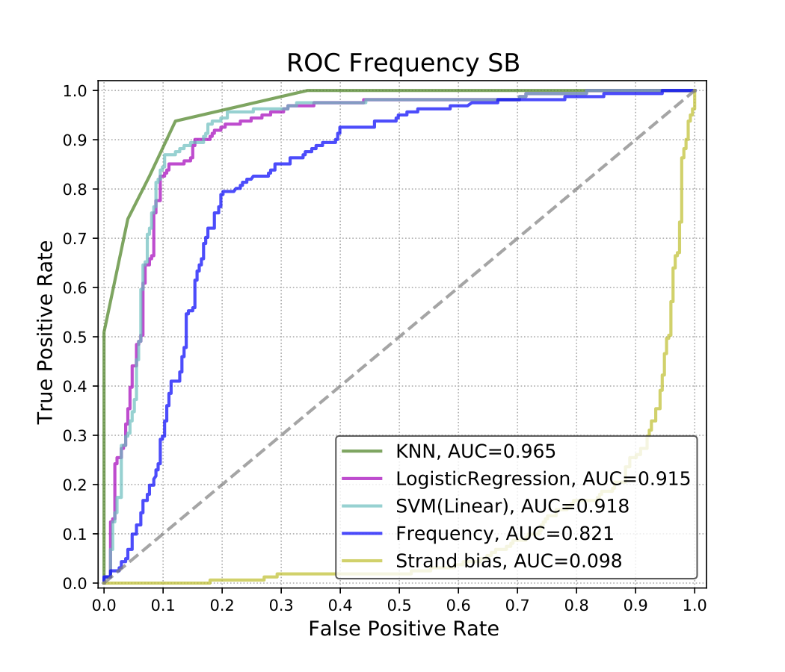

# Machine learning models to improve Nanopore variant calling accuracy

In [Grubaugh et al.](https://genomebiology.biomedcentral.com/articles/10.1186/s13059-018-1618-7), Fig. 5 described the data analysis result of an experiment where 90% Zika virus #1 was mixed with 10% Zika virus #2. The differences between Zika virus #1 and #2 genomes were known and therefore served as prior information. By performing Nanopore sequencing on the mixture and further calling variants, the authors would be able to tell which variants matched with the prior information and which variants did not match. The matching variants were true positive variants, while those not matching were false positives. 

The data analysis in Fig. 5 shows that the authors applied a logistic regression model involving two variables of all variants called—allele frequency and strand bias. Their model improved the accuracy of distinguishing true positives and false positives, as suggested in the ROC curve in Fig. 5b. 

In my repo, I reproduced the logistic regression model as [Grubaugh et al.](https://genomebiology.biomedcentral.com/articles/10.1186/s13059-018-1618-7) did. I also tried SVM and KNN. In addition, the strand bias in Fig. 5 was calculated as 

StrandAF = pmin(ForwardVariantCov, ReverseVariantCov) / pmax(ForwardVariantCov, ReverseVariantCov)

, which could be found in the [github repo](https://github.com/nickloman/zika-isnv) of one author—Nicholas J. Loman. Note that scripts from Nicholas J. Loman's repo were used here. [Guo et al.](https://link.springer.com/article/10.1186/1471-2164-13-666) provided three different measures of strand bias—SB, GATK-SB, Fisher Score. In my logistic regression, SVM, KNN models, these three strand bias measures were used. 

